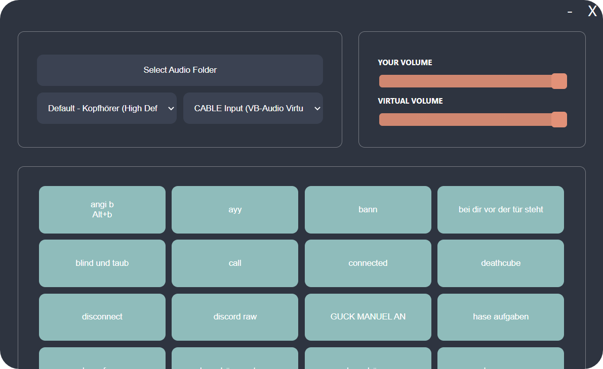

# Electron Soundboard

Simple Soundboard with a nice Nord UI



## Installation

#### Building from Source
Because the release is not signed, its probably better to build from source.
`git clone` the source code to your machine. Make sure to have `yarn` installed, then in the directory:

```
yarn install
yarn build
yarn electron-build
```

Installation files can now be found in the `/dist` folder.

#### Download the Installer
If you trust my code and just want an `.exe`, there is an installer in the realeses section.

---

Once the installation is finished, you'd probably want to add convenient functionality by adding a virtual input Device.
This is neccessary because you want others to hear your own beautiful voice while blasting nickelback through Discord.

### Virtual Audio for Windows
1. Install Virtual VB Cable either through the release `VBCABLE_Driver_Pack.zip` or via the official site https://vb-audio.com/Cable/.
2. Follow Steps for the Installer, make sure to run the installer as `administor` (`right click` `run as administor`) and reboot.
3. You're now able to select Virtual Input in the Device selection in the soundboard program.
4. Pipe your microphone through the Virtual Cable as well by going into the `sound control panel -> recording -> properties (right click on your mic) -> listen`. Now tick `Listen to this device` and select `CABLE Input`.
5. Done! Now you can use `CABLE Output` in any app as device and others can hear your voice and the soundboard at the same time.

